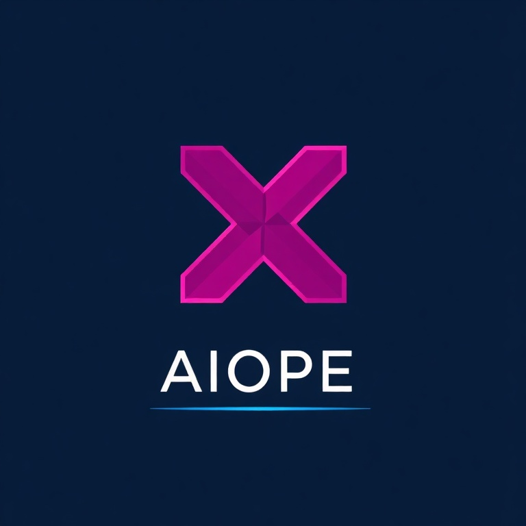
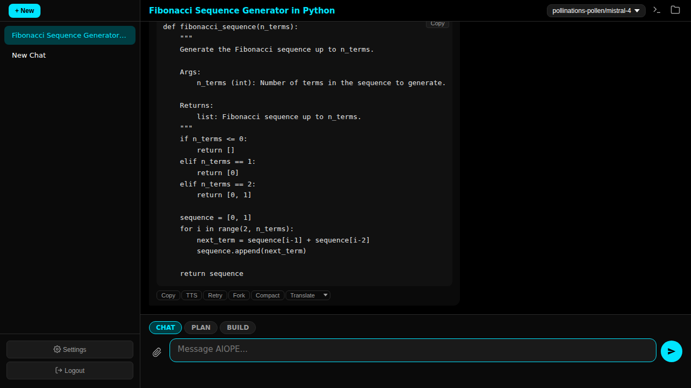

<p align="center"></p>

<p align="center"></p>

# AIOPE Headless

[](https://pollinations.ai)

A headless AI assistant with a web UI, built for the [XNet](https://xnet.ngo) ZeroTier network. Go backend, vanilla JS frontend (single `index.html`), SQLite persistence, WebSocket streaming.

Part of the AIOPE ecosystem — the desktop/server counterpart to the [aiope2](https://github.com/XNet-NGO/aiope2) Android app.

## Quick Start

```sh
# Build
docker build -t aiope-headless .

# Run
docker run -d --name aiope --restart unless-stopped \
  --network host \
  -v ~/.aiope-headless:/data \
  -v ~/.aiope-headless/.ssh:/home/aiope/.ssh:ro \
  -e AIOPE_BIND=10.121.21.25 \
  aiope-headless:latest
```

Accessible at `http://10.121.21.25:8090`. No auth needed when bound to the ZT interface.

## Docker

Multi-stage build: `golang:latest` compiles the binary, `debian:bookworm-slim` runs it with sandboxed tools.

```
Container: aiope (debian:bookworm-slim)
  Binary:  /usr/local/bin/aiope-headless
  Tools:   git, python3, curl, gcc, make, ssh, jq
  Network: host (for ZeroTier access)
  Data:    /data → ~/.aiope-headless (bind mount)
           ├── aiope2-chat.db    SQLite database
           ├── uploads/          Attached images
           ├── generated/        AI-generated images
           ├── workspace/        Agent scratch area
           └── .ssh/             SSH keys (mounted to /home/aiope/.ssh:ro)
```

The agent's shell commands run inside the container sandbox. Data persists on the bind mount across container rebuilds.

### Environment Variables
| Variable | Default | Description |
|----------|---------|-------------|
| `AIOPE_BIND` | `0.0.0.0` | Bind address |
| `AIOPE_PORT` | `8090` | Listen port |
| `AIOPE_DB_PATH` | `/data/aiope2-chat.db` | SQLite database path |
| `AIOPE_GATEWAY_KEY` | (built-in) | API key for default gateway provider |

### Bare Metal

```sh
go build -o aiope-headless .
AIOPE_BIND=10.121.21.25 ./aiope-headless
```

## Features

### Chat
- Multi-turn conversations with streaming responses
- Chat cancellation, message editing, retry, forking
- Auto-title generation for new conversations
- Conversation export (JSON)
- Translation with language selector
- Markdown rendering with syntax highlighting

### Multimodal
- Image attachment via file picker, drag-and-drop, or paste
- Client-side processing: pad to square (black), scale to 448×448, JPEG 85% (matching aiope2's `ImageProcessor`)
- Images sent inline via WebSocket — no separate upload step
- Full multimodal history — LLM sees images from all previous messages
- Image generation via tool calling

### Agent / Tool Use
- Auto-run mode: continues autonomously after tool calls (up to 20 rounds)
- Auto-compact: triggers context summarization at 95% token limit
- Built-in tools: `shell_exec`, `file_read`, `file_write`, `file_edit`, `web_search`, `web_fetch`, `analyze_image`, `task` (sub-agents)
- Per-tool enable/disable via REST API

### MCP (Model Context Protocol)
- JSON-RPC 2.0 client supporting stdio and SSE transports
- Server management: add, connect, disconnect, delete
- MCP tools appear alongside built-in tools

### Providers & Models
- Multi-provider support with per-model configuration
- Model configs: temperature, topP, topK, maxTokens, contextTokens, reasoningEffort, autoCompact
- Per-model overrides: tools, vision, shell/fetch/file-read limits
- Task model system: SUMMARY, TITLE, TRANSLATION, IMAGE_RECOGNITION, SUBAGENT, IMAGE_GENERATION
- Default provider: AIOPE Gateway with 16 pre-configured models

### Memory, Terminal, Remote
- Persistent key-value memory store injected into system prompt
- Integrated web terminal (xterm.js + PTY over WebSocket)
- SSH-based remote server management with auto-seed from `~/.ssh/config`
- Settings import/export

## Architecture

```
main.go                          Entry point, dependency wiring, provider seeding
internal/
  server/server.go    (1720 loc) HTTP routes, WebSocket handler, chat orchestration
  llm/
    openai.go         (261 loc)  OpenAI-compatible streaming client
    orchestrator.go   (279 loc)  Tool-use loop with auto-run
    tools.go          (775 loc)  Tool definitions, execution, task model resolution
  provider/                      Provider/ModelConfig/Profile types, CRUD
  message/service.go             Message persistence with image path storage
  mcp/mcp.go                     MCP JSON-RPC 2.0 client
  terminal/terminal.go           PTY-backed web terminal
  config/                        Config from env vars
  conversation/                  Conversation CRUD
  settings/                      Key-value settings store
  remote/                        SSH remote server management
  ws/                            WebSocket hub and client
  db/                            SQLite setup and migrations
web/
  index.html          (1363 loc) Complete frontend — vanilla JS, no build step
Dockerfile                       Multi-stage: Go build → Debian slim runtime
```

## REST API

### Conversations
```
GET    /api/conversations              List all
POST   /api/conversations              Create new
GET    /api/conversations/{id}         Get with messages
PATCH  /api/conversations/{id}         Update title/mode
DELETE /api/conversations/{id}         Delete
GET    /api/conversations/{id}/export  Export as JSON
```

### Providers
```
GET    /api/providers                  List all
POST   /api/providers                  Create
PUT    /api/providers/{id}             Update (with model configs)
DELETE /api/providers/{id}             Delete
POST   /api/providers/{id}/activate    Set as active
GET    /api/providers/{id}/models      Fetch model list from provider
```

### Tools, Memory, Settings
```
GET    /api/tools                      List tool toggles
PUT    /api/tools/{id}                 Enable/disable tool
GET    /api/memories                   List memories
POST   /api/memories                   Create memory
PUT    /api/memories/{key}             Update memory
DELETE /api/memories/{key}             Delete memory
GET    /api/settings                   Get all settings
PUT    /api/settings/{key}             Set setting
GET    /api/settings/export            Export all settings
POST   /api/settings/import            Import settings
```

### MCP Servers
```
GET    /api/mcp/servers                List servers
POST   /api/mcp/servers                Add server
PUT    /api/mcp/servers/{id}           Update server
DELETE /api/mcp/servers/{id}           Delete server
POST   /api/mcp/servers/{id}/connect   Connect to server
```

### Files & Upload
```
POST   /api/upload                     Upload image (multipart or JSON base64)
GET    /api/upload?path=...            Serve uploaded file
GET    /api/files                      List directory
GET    /api/files/read                 Read file content
```

## WebSocket Protocol

Connect to `/ws`. Messages are JSON with a `type` field.

### Client → Server
| Type | Description |
|------|-------------|
| `chat.send` | Send message. Fields: `conversationId`, `content`, `mode`, `imageData[]` |
| `chat.cancel` | Cancel streaming response |
| `chat.retry` | Retry from message index |
| `chat.edit_resend` | Edit and resend message |
| `chat.fork` | Fork conversation at index |
| `chat.compact` | Trigger context compaction |
| `chat.translate` | Translate a message |
| `chat.auto_run` | Toggle auto-run mode |
| `file.chunk` | Chunked file upload (id, data, done, name) |

### Server → Client
| Type | Description |
|------|-------------|
| `message.created` | New message (includes `imagePaths`) |
| `stream.start` | Streaming begins |
| `stream.delta` | Streaming token |
| `stream.end` | Streaming complete |
| `conversation.created` | New conversation |
| `file.uploaded` | Chunk upload complete (id, path) |

## Powered By

- [Pollinations.ai](https://pollinations.ai) — Open-source generative AI platform

## License

Apache 2.0
